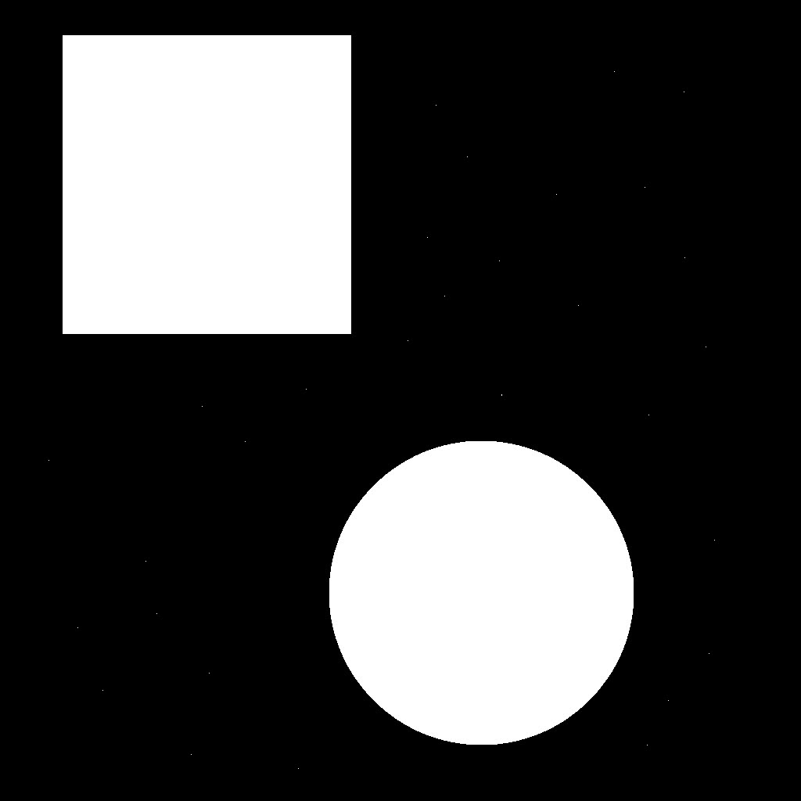

# Description

Pattern recognition involves the automated identification of meaningful patterns or structures within data, enabling machines to categorize, classify, or make decisions based on these recognized patterns. It finds applications in diverse fields like image analysis, speech recognition, and machine learning.

In this project, we tried to find the shapes using pattern recognition process of a digital image with python OpenCV.
Following are the processes taken:

* Noise Reduction
* Histogram
* Thresholding
* Connectivity Analysis
* Pattern Recognition


Below is the original image provided to us.



The image is available in the images folder named as "original_image.jpeg".

Each process mentioned above will create it's own version of image which will also be saved in the images folder.

For the project to run, make sure you have OpenCV package installed.
You can install openCV using the following command in the terminal.

```
sudo apt install python3-opencv
```

Verify the installation with the following command.
```
python3 -c "import cv2; print(cv2.__version__)"
```

Now, you can simply go to the project root folder and run the program.

## Google Slide Presentation

For a detailed design and representation for the above pattern recognition, you can check this link:
[Pattern Recognition with OpenCV](https://docs.google.com/presentation/d/147ZphSAImEnu-Mzm4Dd_Gnh36PmgSuXSd54qAu-aECk/edit?usp=sharing)